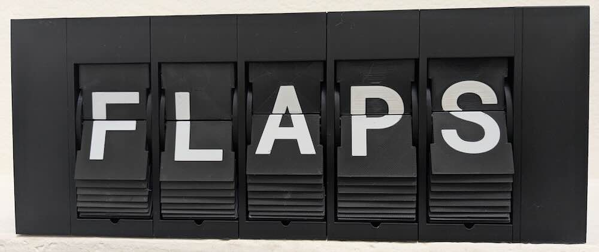

# A 3d-printed Split Flap Display

This project is a redesign of David
Kingsman's [Split Flap Display](https://www.printables.com/model/69464-split-flap-display).



## How it works

This display shows a sequence of symbols in individual 3d-printed modules. Each module contains a drum with flaps
displaying individual symbols. This is similar to a rolodex, except each symbol is split across the front of one flap
and the back of another flap. A motor rotates the drum to change from one symbol to another.

A client (e.g. [this webpage](https://flappy-7d77d.web.app/www)) sends messages to the microcontroller (MCU)
over [MQTT](https://mqtt.org/), a standardized publish/subscribe message protocol designed for IOT devices. Once the MCU
receives a message, it communicates with a series of daisy-chained motor driver circuit boards on the back of each
module. Each driver contains one shift register for controlling a unipolar stepper motor and one shift register for
reading a digital hall effects sensor. Each motor spins until a magnet on the drum activates the hall sensor, indicating
that the drum is at a particular absolute orientation. The motor then spins a specific number of steps to reach the
desired symbol.

## Prerequisites

Building this project from scratch requires a specific set of equipment and skills.

### Equipment

* Required

    * 3D printer with multi-material support (e.g. Bambu Labs A1 mini with AMS [^2]).
    * Device with a USB port capable of running Chrome.
    * [Soldering iron with temperature adjustment](https://www.amazon.com/Soldering-Digital-Welding-Portable-Electric/dp/B08R3515SF?th=1)
      for assembling boards and pushing Ruthex inserts into 3D printed parts.
    * Wire cutters
    * Wire strippers
    * Pliers
    * Allen wrenches

* Recommended

    * ["Dupont" crimping tool](https://www.amazon.com/IWISS-SN-28B-Crimping-AWG28-18-Dupont/dp/B00OMM4YUY?th=1) for
      assembling cables.
    * Multimeter for basic connection and voltage tests.

* Potentially useful
    * Laptop with at least 32GB of RAM for rendering models.
    * Oscilloscope for debugging serial communications.

### Skills

* Required
    * Soldering through-hole components
    * Crimping custom cables
* Recommended
    * The Rust programming language
    * Basic embedded software development
    * Basic understanding of CAD
    * Basic 3D printing debugging skills
    * Basic digital circuit design

## Bill of Materials

| Name of Part                                                                                                                                                                        | Quantity per display | Quantity per letter | 
|-------------------------------------------------------------------------------------------------------------------------------------------------------------------------------------|----------------------|---------------------|
| [Raspberry Pi Pico 2 W MCU with headers](https://www.adafruit.com/product/6328)                                                                                                     | 1                    |                     |
| 12v power supply (at least 250mA per character)                                                                                                                                     | 1                    |                     |
| [Adafruit 12v to 5v converter](https://www.adafruit.com/product/5882)                                                                                                               | 1                    |                     |
| [Custom motor driver circuit board](https://github.com/nathdobson/flappy/tree/main/driver)                                                                                          |                      | 1                   |
| [28BYJ-48 12v motor](https://www.amazon.com/Podazz-4-Phase-5-Line-Stepper-28BYJ-48/dp/B0DCFV3C2C)                                                                                   |                      | 1                   |
| [KY-003 hall sensor module](https://www.amazon.com/Ransanx-Magnetic-KY-003-3-3V-5V-Pressure/dp/B0F32N1LHX?th=1)                                                                     |                      | 1                   |
| [PLA (background color)](https://us.store.bambulab.com/products/pla-basic-filament)                                                                                                 | ~132 g               | ~217 g              |
| [PLA (foreground/text color)](https://us.store.bambulab.com/products/pla-basic-filament)                                                                                            |                      | ~18 g               |
| [PETG](https://us.store.bambulab.com/products/petg-hf) for stacked prints (optional)                                                                                                |                      | ~30 g               |
| Ruthex M2 inserts                                                                                                                                                                   | 4                    | 8                   |
| Ruthex M3 inserts                                                                                                                                                                   | 4                    | 6 - 8               |
| [M2 x 6mm button head screws](https://www.amazon.com/dp/B0CNQXP56N?th=1)                                                                                                            | 4                    | 6                   |
| [M2 x 10mm button head screws](https://www.amazon.com/dp/B0CNQVP8CC?th=1)                                                                                                           |                      | 2                   |
| [M3 x 6mm button head screws](https://www.amazon.com/dp/B0DNMZWZZV?th=1)                                                                                                            |                      | 6                   |
| [6mm x 2mm disc magnets](https://www.amazon.com/dp/B0CZ71S57Y?ref=ppx_yo2ov_dt_b_fed_asin_title&th=1) for drum                                                                      |                      | 1                   |
| Assorted dupont crimps, housings, and pin headers                                                                                                                                   |                      |                     |
| [26 AWG UL1061 stranded wire](https://www.remingtonindustries.com/hook-up-wire/hook-up-wire-26-awg-ul1061-stranded-kit-2-color-sets-2-spool-sizes-available) for hall sensor cables |                      |                     |
| Assorted solid wire for manually soldered boards                                                                                                                                    |                      |                     |
| Assorted stranded wire for cables                                                                                                                                                   |                      |                     |

## Repository structure

The repository is divided into several hardware and software components:

* [common/](common/) A cargo workspace with utilities and configuration in use by several components
* [driver/](driver/) A KiCad PCB design for the motor driver attached to each character.
* [firmware/](firmware/) A cargo workspace with the firmware for the Raspberry Pi Pico 2 W.
* [models/](models/) A cargo crate with binaries that generate .3mf files for each 3D-printed part.
* [native-client/](native-client/) A cargo workspace with a binary for configuring the display over USB or Bluetooth.
* [spindle/](spindle/) A cargo workspace with a simple scripting language for controlling the display.
* [submodules/](submodules/) A set of git submodules with forks of dependencies.
* [submodules/patina-rs](submodules/patina-rs/) A CAD library for generating 3D meshes from SDFs (signed distance
  functions).
* [web-client](web-client/) A WASM web application for interacting with the display.

## Instructions

### Hardware

1. Download the [latest release](https://github.com/nathdobson/flappy/releases/latest).
1. Order driver PCBs with JLCPCB:
    * `driver-jlcpcb-GERBER.zip` for producing the raw boards.
    * `driver-jlcpcb-BOM.csv` for ordering parts.
    * `driver-jlcpcb-CPL.csv` for placing and assembling parts.
1. For each module, print one each of the following:
    * `model-housing.3mf`: An enclosure for the module.
    * `model-inner.3mf`: The inner half of the drum.
    * `model-outer.3mf`: The outer half of the drum.
    * `model-flaps.3mf`: All flaps, stacked with PETG support. Ensure you have flow ratios tuned correctly for all
      filaments. This is effectively a 100% infill print, so overextrusion will ruin the top flaps. Underextrusion of
      the PLA will result in noticeable gaps. Underextrusion of the PETG support will ruin the surface quality of the
      PLA as it sinks into the gaps.
2. For each display, print one of the following:
    * `model-left-cap.3mf`: The cap for the left side of the display, where the motherboard goes.
    * `model-right-cap.3mf`: The cap for the right side of the display.
1. Press M2 and M3 Ruthex threaded inserts into the prints with a soldering iron.
1. Glue magnets into the inner drums. Ensure magnets are in the appropriate orientation for your sensors.
1. Connect inner and outer drums with screws.
1. Insert flaps into drum. PLA flaps should bend enough to fit in. Aligning the first letter with the magnet will
   simplify later calibration.
1. [Important] Remove the pull-up resistor or pull-up LED from the sensors[^1]. This is easy with flush cutters.
1. Route the motor and sensor cables through housings.
1. Connect all cables.
1. Connect the motors, sensors, and drivers to the housings with M2 and M3 screws. Ensure the motor tabs are properly
   centered on the supports.
1. Press the drum assemblies onto the motor axle. Ensure all flaps are pointed clockwise so they won't jam as the drum
   assembly rotates counter-clockwise.

### Software

1. Set up an MQTT broker (e.g. with https://www.emqx.com/).
1. Install the firmware by loading the [setup tool](https://flappy-7d77d.web.app/www/?tab=setup) in Chrome.
1. Fill out the settings in the setup tool. See [blank.json](native-client/blank.json) for defaults.
1. Enter the MQTT broker details in the [connect tool](https://flappy-7d77d.web.app/www/?tab=setup). You can use the resulting URL to connect to the display.
1. Adjust calibration values until the expected letters appear consistently.

## Controlling the display

### MQTT Protocol

In addition to controlling the display with the website, you may communicate directly with the display over MQTT. Each
display publishes or
subscribes to a set of topics with a common topic prefix.

#### Topic prefix + `"/info"`

The display publishes a `DeviceInfo` message (see [common/protocol/src/setup.rs](common/protocol/src/setup.rs)) on this
topic. This message is retained by the server, so new subscriptions to this topic will immediately receive this message.

#### Topic prefix + `"/request"`

Clients may publish `DisplayRequest` messages (see [common/protocol/src/display.rs](common/protocol/src/display.rs)) on
this
topic. If the display is processing a previous request when a new request arrives, the display cancels the previous
request and starts the new one.

##### `Run` messages

To display a single static message, send a UTF-8 encoded string as follows:

```
{"Run": "helloworld"}
```

The display splits the message into unicode graphemes, then tries to find the best match for each grapheme. The
algorithm accounts for [Unicode Equivalence](https://en.wikipedia.org/wiki/Unicode_equivalence) and capitalization.

##### `RunSpindle` messages

To display a repeating or changing message, send a UTF-8 encoded `spindle` script as follows:

```
{"Run": "display(\"hi\");sleep_ms(1000);display(\"hi\");"}
```

See the [Spindle](spindle/README.md) documentation for details on the scripting language.

#### Topic prefix + `"/response"`

When the display starts spinning the flaps to a new position, it sends a `Start` message with the content that will
appear. This message may not exactly match the original message due to normalization or capitalization changes.

```
{"Start":["H","E","L","L","O","W","O","R","L","D"]}
```

When the display stops spinning the flaps, it sends an equivalent `Stop` message:

```
{"Stop":["H","E","L","L","O","W","O","R","L","D"]}
```

The stop message is retained, so clients may determine the current contents of the display.

[^2]: The provided 3MF files are configured for use with BambuStudio and tuned for PLA with PETG support on the Bambu A1 Mini
with AMS. The files will likely work on other slicers and printers, but may require additional tuning.

[^1]: The KY-003 board contains an A3144 digital hall sensor chip. The A3144 has a minimum Vcc of 4.5V and open-collector
active-low digital output. The KY-003 includes a resistor and LED in series to pull-up the output signal to Vcc. This
pull-up means the minimum logic output voltage for the KY-003 is also 4.5V. The
Pico's maximum logic voltage is 3.3V, so it cannot connect to a KY-003 without some extra work. Also, the LED introduces
a
voltage drop, which makes it's use as a pull-up in the first place questionable. Instead, we remove the pull-ups from
the KY-003, provide 12V to Vcc, and add a pull-up resistor to 3.3V on the driver board. Failure to remove the pull-ups
will likely result in damage to the driver boards.